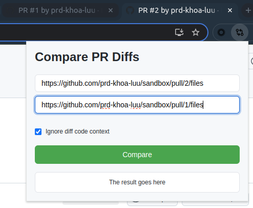
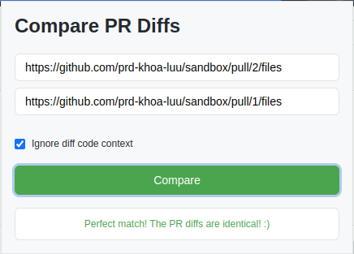

# Github Pull Request Diff Comparison Tool
This is a Chrome extension for comparing 2 Github PRs.
A Firefox extension may come later :)

## Why?
This extension can help you compare 2 PRs, especially when one is a cherry-pick version of the other. No more silly cherry-pick/merge/rebase mistakes!

## Installation
This extension is not available on the Chrome Web Store, so you need to install it manually.

1. Download the latest release from this repo
2. Go to `chrome://extensions/`
3. Enable "Developer mode"
4. Click "Load unpacked" at the top left corner
5. Find and select the downloaded extension folder

## How it works
The tool aims to provide basic `git range-diff` functionality for Github PRs.
Some good explanations of `git range-diff` can be found in this question [Can somebody explain the usage of git range-diff?](https://stackoverflow.com/a/61219652/14725572)

## Usage
Follow these steps

1. Open 2 PRs in 2 tabs
2. Copy one of the PR URLs
3. Go to the other PR tab
4. Click the extension icon -- you will see that the first input box is automatically filled with the current tab URL
5. Paste the URL of the PR you copied in the second input box
6. Uncheck the "Ignore diff code context" checkbox if you want to take the code around the diffs into account when doing the comparison
7. Click "Compare"

Screenshots
* 
* 

## TODOs
* Options to run the comparison on specific files or commits
  * This probably requires a diff parsing library such as [diff2html](https://github.com/rtfpessoa/diff2html?tab=readme-ov-file#diff2html-api) and [parse-diff](https://github.com/sergeyt/parse-diff)
* Keyboard shortcut activation
* [v2] Showing diff details

## Acknowledgements
* This tool is built mainly by GPT-4o and Claude 3.5 Sonnet.
* The extension's favicon is provided by [Lucide](https://lucide.dev/).
